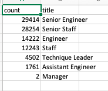
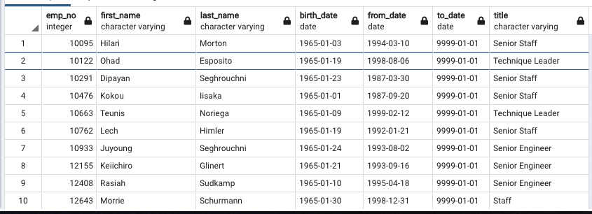

# Pewlett-Hackard-Analysis

### Module 7 - SQL

## Overview
The objective of this assignment is to help Pewlett-Hackard evaluate the amount of employees who will soon be retiring and identify employees who are eligible to participate in a mentorship program in order to prepare for the "silver tsunami".

- In deliverable 1 our purpose is to identify the titles of the employees that are due to retire soon (born between 1952 and 1955) and to count the number of retiring employees currently in each title.

- In deliverable 2 our task is to identify which employees currently working at Pewlett-Hackard are eligible for a mentorship program. The eligibility requirements are that the employee is born in 1965. An additional requirement I used in this deliverable is "title.to_date" to ensure that the employees current title is listed for mentorship.

## Results
### **Deliverable 1 - Number of Retiring Employees by Title**
- In deliverable 1 we discovered that there are over 90K employees that are due to retire in the the next few years. Collectively, those 90K employees have held 133K positions, meaning that approximately 47% of those employees have held  multiple positions within the company.
- The 90K retiring employees hold only 7 different titles. The highest risk positions for retirement are Senior Engineers and Senior Staff, with the assumption that they have been there the longest and are the best in their role compared to "staff" and "engineers".

 </img> 

### **Deliverable 2 - Employees Eligible for a Mentorship Program**

-  In deliverable 2 we assessed the amount of staff and their current roles eligible to be included in the mentorship program. There are 1549 current staff members born in 1965 (the criteria for eligibility) to be mentored.
- There is an anomaly between the given output for the challenge versus the module instructions. Employee 10291 is eligible for mentorship, but in the module his title is staff, even though in the titles table the first listed and current title for this employee is senior staff.
 </img>

## Summary

Over 90K roles will need to be filled by Pewlett-Hackard as the "silver tsunami" comes in to effect and potentially 90k mentors. Unfortunately, based on criteria required for mentorship, there are much fewer employees eligible for the program than potential mentors. This could easily be remedied by widening the eligibility criteria. 

**Additional Questions**

What would the results look like if we were to create a table examining current employees born between 1965 and 1985 and considering them for mentorship? - the program could be a lot more balanced.
Another table/query that would be helpful for this analysis would be to determine which departments the eligible and retiring and mentored employees are from and another query to create a mentorship_titles table to pair with the retiring_titles table. This would give us a more helpful idea of where Pewlett-Hackard will need to hire, and what departments would be best suited for a mentorship program. 
